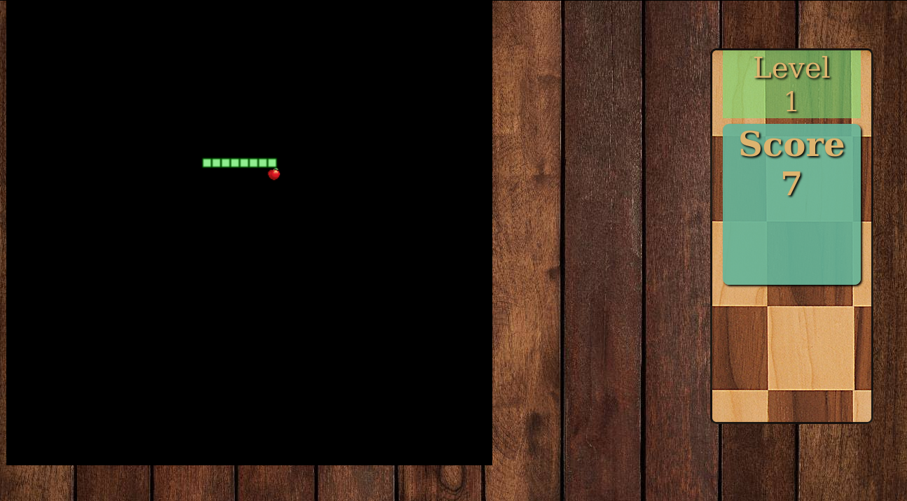

# Snake-Game-using-OOPs
Snake Game using basic concept of OOPs in javascript.

# Screenshot

# Rules

Level 1:

- Generate food every time at random positions where the snake is not present

- The length of the snake should be increased by one every time when the snake eats food.

- The score increases by one when the snake eats food

- Snake when reaches the boundary on one side, should pass to the other opposite side of the wall

- Snake, when intersecting with each other, will be died

- When the score reaches 20, you move to level 2

 

Level 2:

- Add mines on board apart from food at the random position where the snake is not present. Snake when touches mine, it will be killed

- When the score reaches 40, you move to level 3

 

Level 3:

- Add multiple mines on board apart from food at the random position where the snake is not present. Snake when touches mine, it will be killed

- When the score reaches 60, you move to level 4

 

Level 4:

- Restrict snake from passing through boundaries i.e. when it reaches boundary co-ordinate, it will be killed.

- When the score reaches 80, you move to level 5

 

Level 5:

- Add 2 walls on the board, which can kill a snake when their co-ordinate gets matched

- When the score reaches 100, "You Win!!!"
